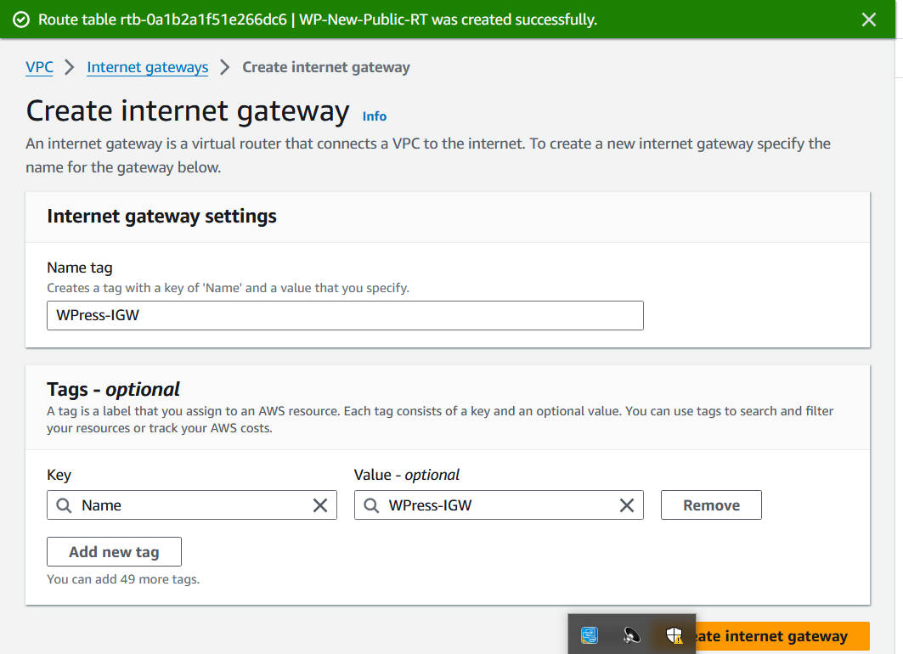
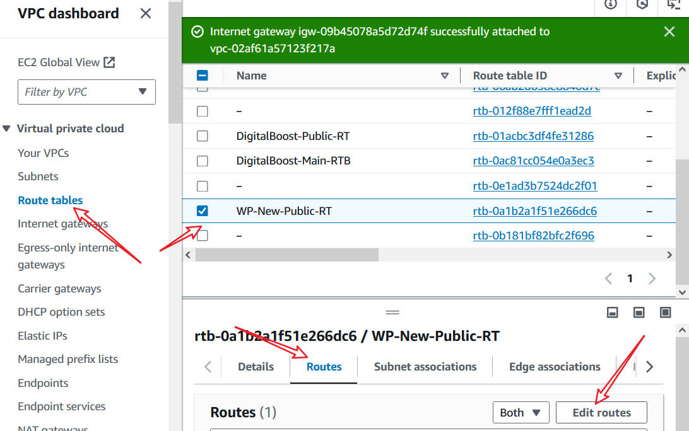

# **WordPress Site on AWS for DigitalBoost.** #
A small to a medium-sized digital marketing agency, "DigitalBoost", wants to enhance its online presence by creating a high-performance WordPress-based website for their clients. The agency needs a scalable, secure, and cost-effective solution that can handle increasing traffic and seamlessly integrate with their existing infrastructure.

## **Task** ##
As an AWS Solutions Architect, my task is to design and implement a WordPress solution using various AWS services, such as Networking, Compute, Object Storage, and Databases.

## **1. Create a VPC (Virtual Private Cloud)** ##

### Step 1: Define Address Range for the VPC. ###
### Step 2:  Create VPC with Public and Private Subnets ###

* **Create VPC:**

Search for VPC service from the search bar and navigate to it. Then you click on create VPC.

    
Name of your choice for the VPC, detrmine the CIDR block for the VPC and some other configuration.

* **Create Subnets:**

 
  After navigating to Subnet under VPC service, then click on create subnet.

   
    Create with the VPC we previously created. Give it a name that'll indicate public, select an availability zone and other configuration. Then create.

   
    Give similar configuration for the Private Subnet, but with a different CIDR block. Then create.

 ### Step 3: Configure Route Tables for Each Subnet ###
* **Create Route Table for Public Subnet:**

    

    Go to the Route Tables section in the VPC Dashboard.
    Click on "Create Route Table".

    
    
    - Name: Public-Route-Table
    - VPC: WordPress-VPC
    - Click on "Create route table".

    Add Internet Gateway: 

    
    

    - Go to the Internet Gateways section.
    - Click on "Create Internet Gateway".
    - Name: your choice
    - Click on "Create internet gateway".

    
    

    - Select the newly created Internet Gateway and click "Attach to VPC".
    - Choose VPC you created and click "Attach internet gateway".

   Update Route Table:

    
    
Go to the Route Table section, select your public-RT. edit the route to target the internet gateway we created and then save.

    Associate Public Subnet: 

    
    
    Go to the Subnet Associations tab, edit, select public-subnet and click on save association.

 *  **Create Route Table for Private Subnet:**

    

    - Name: your Private-Route-Table
    - VPC: the VPC you created.
    - Click on "Create route table".

    
After selecting the Private, associate the private asubnet as we did for public subnet.

### Step 4: Configure a NAT Gateway for Private Subnet Internet Access ###

* **Create an Elastic IP for the NAT Gateway:**

    
    
    Navigate to the Elastic IPs section in the VPC Dashboard.Click on "Allocate Elastic IP address".Click "Allocate".

* **Create the NAT Gateway:**

    
    
    Search and select NAT Gateway, select your public-subnet, select the elastic IP you just created and then click on create .

* **Update the Route Table for the Private Subnet:**

    
    
    Go to route table section and select yout private-subnet,edit and add route, target to the new NAT Gateway and save route.

## **Guide to Deploy a Managed MySQL Database Using Amazon RDS for WordPress Data Storage** ##

### Step 1: Create an Instance. ###

* Acess EC2 Dashboard:

Search for EC2 in the services search bar. Click on EC2 to open the EC2 Dashboard and click the launch instance botton.

### Step 2: Launch an Instance ###

* **Choose an Amazon Machine Image (AMI):**

    
   
   - Name your instance.
   - Select an AMI from the list. You can choose from Amazon Linux, Ubuntu, Windows, or other pre-configured images.

* **Select a Key Pair:**

   
   create a new key pair or you can select from any of which you've created before.

* **Configure Instance Details:**

    
    Choose your vpc and the subnet attached to the vpc.

    
    
    Create a new security group or select an existing one. Add rules to allow necessary traffic as shown for the project.
    
    
    
    Click on launch after necessary configuration.

### **Step 3: Guide to SSH into an EC2 Instance and Run Commands** ###

After launching your instance and it running, then you might want to ssh into the instance. 

Click on the connect here.

Go ahead and click on SSH client and then copy the command below. You might different names, depending on the name of your keypair.

Open the terminal you are familiar with, I'm using Gitbash here. 
You'd need to `cd`(go) into the directory your keypair is located. I downloaded mine to download folder, so i `cd into the Download directory.

So then, paste the command you copied previously in our steps above. Being the first time SSH into the instance, you'd be asked to type and enter the `yes` option to proceed.

 
 `sudo su` command is to switch to the root user.
The `yum update -y` command will download and install the latest updates for all installed packages. This process may take a few minutes. My packages are all installed and updated upto date.

**Create an EFS File System**
Configuration steps as follows:

Search and navigate to EFS Dashboard on AWS, then go ahead to create.

Click on "Create file system".
Name the file system (e.g., wordpress-efs). And VPC: Choose the VPC where your WordPress instances are running.

Availability and Durability: Select "Regional" for multi-AZ access.

Throughput mode: Choose "Bursting" for typical use cases. Performance mode: Choose "General Purpose".

Review all the settings.
Click "Create".

**Install NFS Utilities and other configuration:**

Run `sudo yum install -y nfs-utils` command to install NFS utilities in your terminal.

Create a Mount Point.

Run the following command to mount the EFS file system. Replace fs-0f9c428d759181662.efs.us-east-1.amazonaws.com with your EFS file system DNS name: `sudo mount -t nfs4 -o nfsvers=4.1,rsize=1048576,wsize=1048576,hard,timeo=600,retrans=2,noresvport fs-0f9c428d759181662.efs.us-east-1.amazonaws.com:/ /var/www/html`. 

**Install Apache and Related Packages:**

Install enablr and start Apache(httpd)  with commands highlighted in the image above.

This setup ensures that your EC2 instance has Apache HTTP Server installed and running, ready to serve web content.

**Create an Amazon RDS Instance with MySQL Engine**

1. **Navigate to RDS Dashboard**
2. **Create a New Database:**
    * Click on "Create database".
    * Select the "Standard Create" option.
    * Engine options: Choose MySQL.
3. **Specify DB Details:**
    * DB instance identifier: wordpress-db.
    * Master username and password: Choose a username (e.g., admin). And a desired password.
4. **Configure Instance:**
    * Storage type: Select General Purpose (SSD) and specify the allocated storage (e.g., 20 GB).
5. **Set Up Networking:**
    * VPC: Choose the VPC where your WordPress application is running.
    * Subnet group: Select a subnet group that includes subnets in different Availability Zones.
    * Public access: Set to No for enhanced security.
    * VPC security groups: Choose the same security group with the instance you created that allows access from your WordPress instances.
6. **Database Options:**
    * Initial database name: wordpress_db.
    * Leave other settings as default.
7. **Create Database:**
    * Review your settings and click "Create database".

### **Step 4: Install MySQL 5.7 and Connect to an RDS Database** ###

Firstly, SSH into the terminal just like we did previously. Then go ahead to install, enable and start MySQL with command as displayed below

* `sudo rpm -Uvh https://dev.mysql.com/get/mysql57-community-release-el7-11.noarch.rpm`

* `sudo rpm --import https://repo.mysql.com/RPM-GPG-KEY-mysql-2022`

* `sudo yum install mysql-community-server -y`

* `sudo yum install mysql-server -y`

* `sudo systemctl enable mysqld`

* `sudo systemctl start mysqld`

### **Step 5: Connect to the RDS MySQL Database** ###

**Connect to the RDS MySQL Database:**
Run the following command to connect to your RDS MySQL database. Replace `databaseforwordpress.cdyq80q08jtz.us-east-1.rds.amazonaws.com` admin, and password with your RDS endpoint, username, and password:
`mysql -h databaseforwordpress.cdyq80q08jtz.us-east-1.rds.amazonaws.com -u admin -p`. 

When prompted, enter the password for the admin user.

### **Step 5: Connect WordPress to the RDS Database** ###

1. * SSH into your WordPress server.
    * Open the wp-config.php file located in your WordPress directory.

    
    * Update the database configuration settings as follows:

2. **Set Correct Permissions:**
* Ensure the web server has the appropriate permissions to access the EFS directory:

`sudo chown -R www-data:www-data /mnt/efs/wp-content`

    `sudo chmod -R 755 /mnt/efs/wp-content`

* Replace www-data:www-data with your web server's user and group if different.

3. **Restart Web Server:**
* Restart the web server to apply changes:

    (For Apache):
    `sudo systemctl restart apache2`

    (For Nginx): 
    `sudo systemctl restart nginx`

### **Step 6: Add an Application load balancer.**
### Deploying ALB(Application load balancer) with 2 instances ###
**Task 1: Create Two EC2 Instances**
* Log in to the AWS Management Console
* Navigate to the EC2 service
`#!/bin/bash
yum update -y
sudo yum install -y httpd 
sudo systemctl enable httpd 
sudo systemctl start httpd`  create an AMI and paste the UserData script into the "Advanced Details" section under "User data".

**Task 2: Set Up ALB**

* Create a new Application Load Balancer (ALB)

Navigate and click on create load balancer.

* Configure ALB settings.

* Enter a name and choose the same VPC  where your EC2 instances reside.
* Assign security  settings.
* Configure routing.

**Task 3: Create a Target Group for the Listener.**
* Navigate to the Target Groups Section.
* Create a New Target Group
* Configure the Target Group Settings.
* Register Targets
* Review and Create
* Attach the Target Group to the ALB Listener

### **Configuring Auto scaling with ALB using launch template** ###
**Task 1: Create Launch Template**

Step 1: Log in to the AWS Management Console

Step 2: Navigate to the EC2 Service

Step 3: Access Launch Templates

Step 4: Create a New Launch Template

Step 5: Configure the Launch Template Settings

Step 6: Navigate back to the Launch template

**Task 2: Set Up Auto Scaling Group**

Step 1: Navigate to Auto Scaling Groups

Step 2: Create a New Auto Scaling Group

Step 3: Choose a Launch Template

Step 4: Configure Auto Scaling Group Settings

Step 5: Set Up Additional Configurations
* Network Settings
* Load Balancing (Optional)
* Scaling Policies
* Instance Protection (Optional): Enable instance protection to prevent specific instances from being terminated during a scale-in event.
* Health Checks
* Add a notification (optional)
* Set the health check grace period.
* After configuring all necessary settings, click the "Create Auto Scaling group" button at the bottom of the page to finalize the setup.

**Task 3: Test Auto Scaling**
* Connect to one of the instances in your Auto Scaling group using SSH.
* Install the necessary tools to generate CPU stress.

`sudo amazon-linux-extras install epel -y`

`sudo yum install stress -y`

    
    

    

